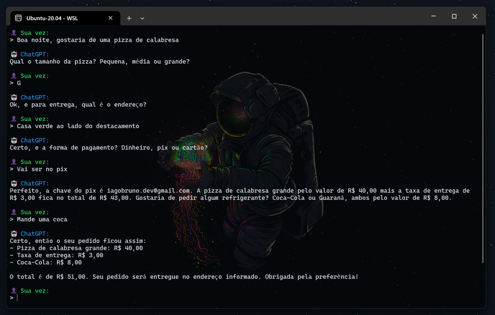

# pizza-chat

Um chatbot que automatiza o atendimento de uma pizzaria usando a API da ChatGPT.



## Como começar

```
git clone https://github.com/iagobruno/pizza-chat.git
cd pizza-chat
yarn install
cp .env.example .env
```

> Configure a sua chave de api da OpenAI no arquivo `.env`.

Inicie o chat:

```
yarn run start
```
